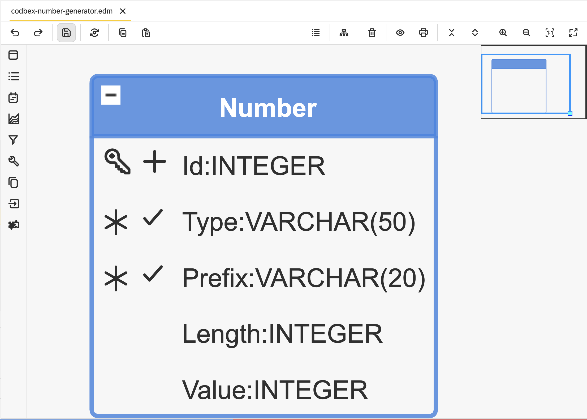

#  codbex-number-generator

## 📖 Table of Contents
* [🗺️ Entity Data Model (EDM)](#️-entity-data-model-edm)
* [🧩 Core Entities](#-core-entities)
* [🔗 Sample Data Modules](#-sample-data-modules)
* [🐳 Local Development with Docker](#-local-development-with-docker)

## 🗺️ Entity Data Model (EDM)



## 🧩 Core Entities

### Entity: `Number`

| Field  | Type     | Details                     | Description                              |
|--------| -------- | --------------------------- | ---------------------------------------- |
| Id     | INTEGER  | PK, Identity      | Unique identifier for the number.        |
| Type   | VARCHAR  | Length: 50, Unique, Not Null          | Type of the number.                      |
| Prefix | VARCHAR  | Length: 20, Unique, Not Null         | Prefix for the number.                   |
| Length | INTEGER  | Nullable                    | Length of the number.                    |
| Value  | INTEGER  | Nullable                    | Value of the number.                     |

## 🔗 Sample Data Modules

- [codbex-number-generator-data](https://github.com/codbex/codbex-number-generator-data)

## 🐳 Local Development with Docker

When running this project inside the codbex Atlas Docker image, you must provide authentication for installing dependencies from GitHub Packages.
1. Create a GitHub Personal Access Token (PAT) with `read:packages` scope.
2. Pass `NPM_TOKEN` to the Docker container:

    ```
    docker run \
    -e NPM_TOKEN=<your_github_token> \
    --rm -p 80:80 \
    ghcr.io/codbex/codbex-atlas:latest
    ```

⚠️ **Notes**
- The `NPM_TOKEN` must be available at container runtime.
- This is required even for public packages hosted on GitHub Packages.
- Never bake the token into the Docker image or commit it to source control.
